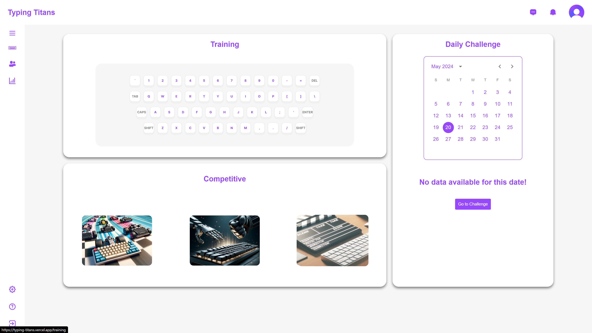

# Typing-Titans

<!-- PROJECT LOGO -->
<br />
<div align="center">
    
</div>

## About The Project

<br />
<div align="center">
    
</div>
<br />

Typing Titans is an engaging learning platform designed to help users improve their typing skills through competitive races, built with a modern tech stack including TypeScript, React, Redux, Express, Socket.io, and PostgreSQL, the project involved integrating various APIs to retrieve and display essential data. Real-time user connectivity was enabled using Socket.io, supporting live competitions and chat functionalities. Comprehensive logic was developed to facilitate competitive typing races between users, making Typing Titans an interactive and effective tool for enhancing typing speed and accuracy.

<!-- GETTING STARTED -->
## Getting Started

This is an example of how you may set up this project locally.
To get a local copy up and running follow these simple example steps:


### Installation

_Below is an example of how you can instruct your audience on installing and setting up your app. This template doesn't rely on any external dependencies or services._

1. Get a free API Key at [https://api-ninjas.com](https://api-ninjas.com/)
2. Clone the repo
   ```sh
   git clone https://github.com/Thesis-Project-Codeworkds/Typing-Titans
   ```
3. Install NPM packages
   ```sh
   npm install
   ```
4. Enter your API in `.env`
   ```js
    VITE_API_KEY = ENTER YOUR API;
   ```

<p align="right">(<a href="#readme-top">back to top</a>)</p>

